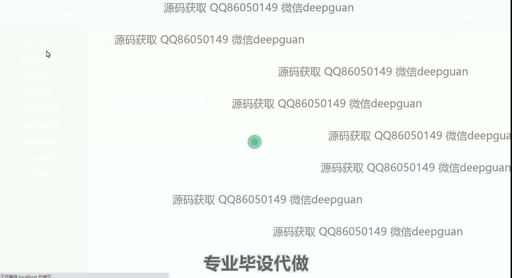
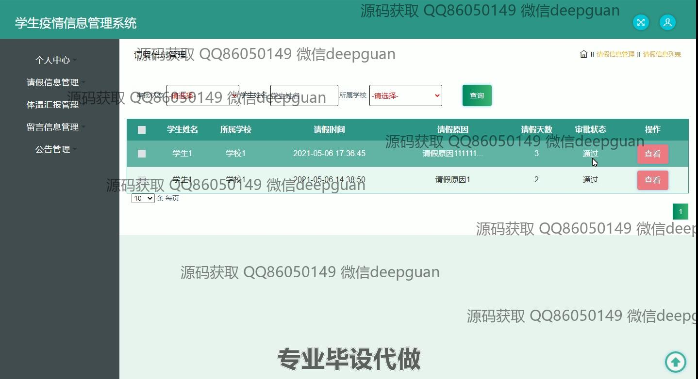

<h1 align="center">学生疫情信息管理系统</h1>

## 简介
学生疫情信息管理系统：角色分为管理员、教师和学生；功能包括个人信息管理、疫情填报、请假信息管理、体温汇报管理、公告和留言信息管理。    --计算机毕业设计源码；毕设源码；java毕业设计源码

## 联系方式

<h3 align="center">获取完整代码与数据库文件 + 微信：deepguan QQ: 86050149 QQ群: 783742310</h3>

<h3 align="center">可帮忙远程部署 包运行成功！提供远程部署、修改代码、设计文档指导、代码讲解等服务！</h3>

## 功能介绍（完整见运行截图）
管理员：管理员可访问系统主要功能模块，包括个人中心、教师管理、学生管理、请假信息管理、体温汇报管理、基础数据管理、留言信息管理和公告管理。管理员可以添加和管理教师及学生的基本信息，审核与管理学生的请假申请，录入和查看学生的体温数据，管理发布系统公告，并对留言进行审核和处理。管理员还负责系统用户权限管理，包括新增用户、修改用户信息及密码重置等操作。

学生：学生通过登录系统进入个人中心，管理和更新个人信息，并进行每日健康打卡和体温数据申报。在需要请假时，学生可通过系统填写和提交请假信息，待管理员审批。学生可以查看自己的体温记录及相关健康状态，还可以浏览由管理人员发布的公告信息。系统提供了简单的界面让学生进行体温汇报、请假申请及上传相关文件，以确保有效追踪学生健康信息。

教师：教师进入系统后可管理个人信息和查看相关公告。教师信息由管理员更新，包含基本联系信息及所属学校等。教师也可通过个人中心加强对疫情信息的掌握，以支持学校防疫措施的实施。

访客：访客主要指未注册或未登录的用户，通常无法访问系统的内部功能模块。访客可通过展示的公共信息了解系统的用途及主要功能模块，但需要注册或登录后才能进行详细的操作和信息管理。

## 运行截图

本代码来源于网络,仅供学习参考使用!

